# Docker

На зображенні показано вікно Docker Desktop. Запущений один контейнер під назвою "welcome-to-docker", який використовує порт 8088 та працює в даний момент.

 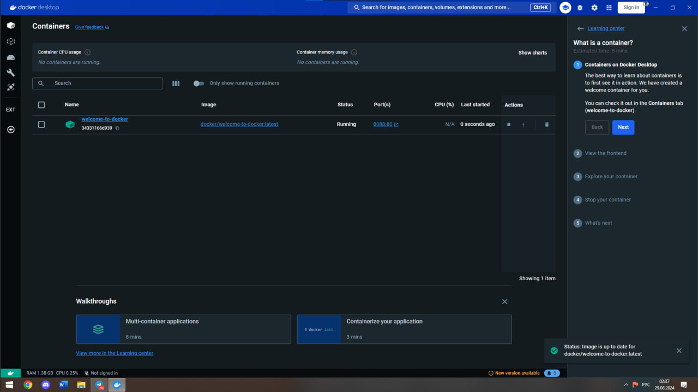 

У самому контейнері можливо переглядати його роботу, налаштування та інший функціонал.

 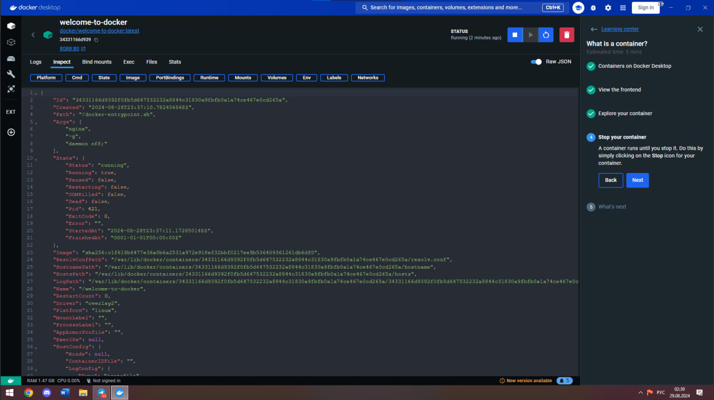 

У необхідній папці створюємо клон репозиторія для навчання та переходимо в необхідну папку.

 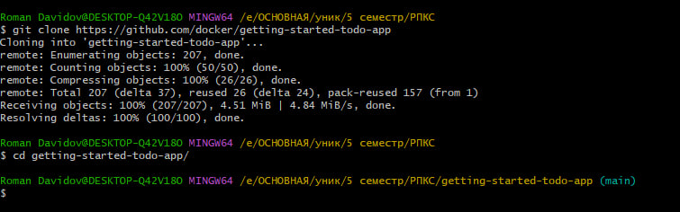 

Далі за допомогою команди "docker compose watch" ми включаємо спостереження за файлами в директорії.

 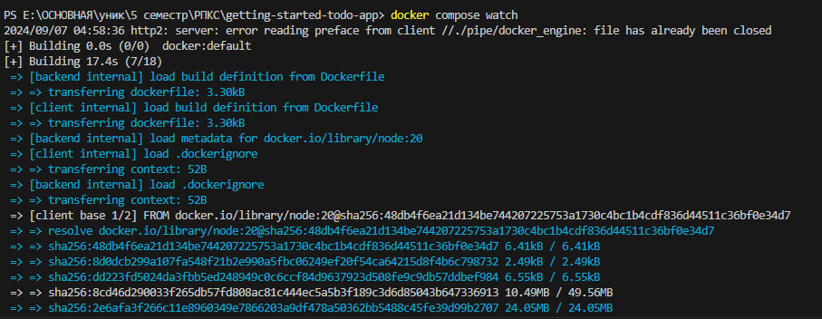 

Після виконання видно, що з'явився Docker контейнер.

 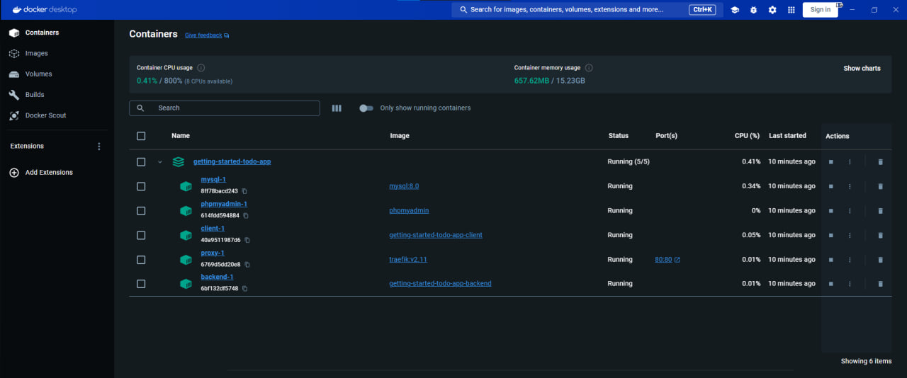 

Закінчення команди "docker compose watch".

 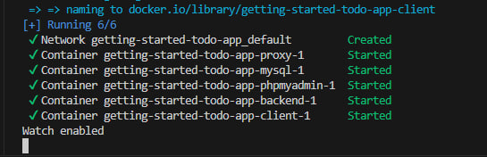 

Бачимо, що відбувся запуск програми і все працює.

 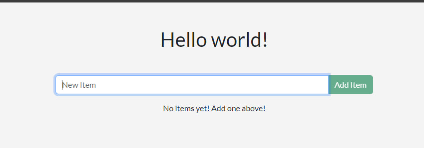 

Тепер внесемо деякі зміни у файл "backend/src/routes/getGreeting.js" і виведемо випадкове з написів.

 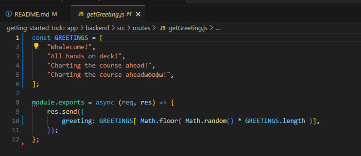 

Можна побачити, що зміни були внесені в загальний проєкт.

 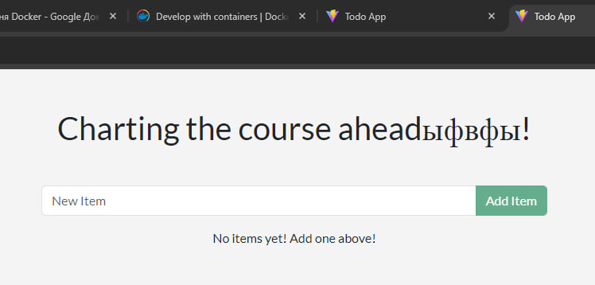 

Далі внесемо зміну плейсхолдера за шляхом "client/src/components/AddNewItemForm.jsx".

 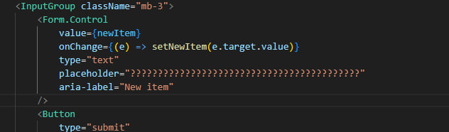 

І тепер видно, що зміни були внесені.

 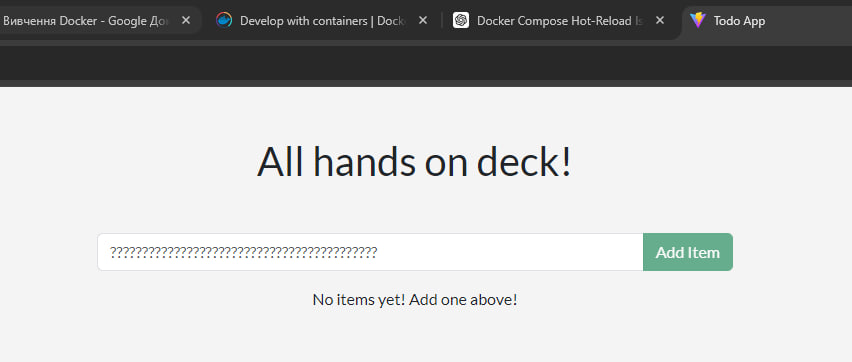 

Точно так само внесемо зміни заднього фону на червоний. При збереженні всі зміни вносяться автоматично.

 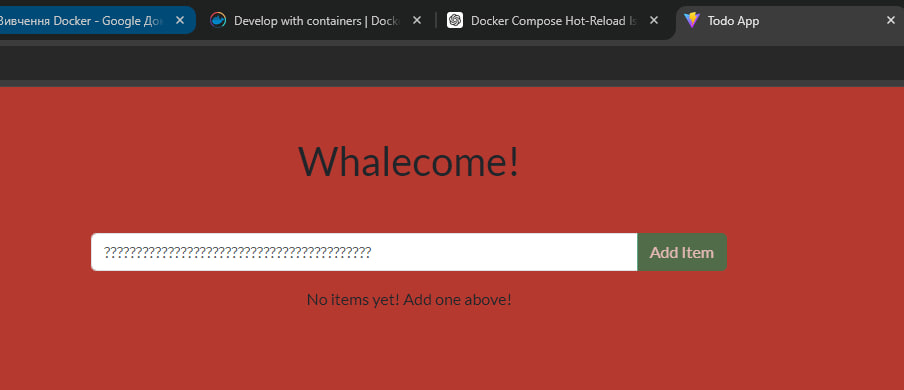 

